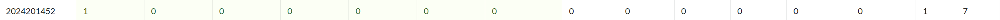

# bomblab 报告

姓名：卫兴铎

学号：2024201452

| 总分 | phase_1 | phase_2 | phase_3 | phase_4 | phase_5 | phase_6 | secret_phase |
| --------- | ------------- | ------------- | ------------- | ----------------- |-----------|-----------|-----------|
| 7        | 1            | 1            | 1            | 1 |1  |1  |1  |


scoreboard 截图：



<!-- TODO: 用一个scoreboard的截图，本地图片，放到 imgs 文件夹下，不要用这个 github，pandoc 解析可能有问题 -->

## 解题报告

<!-- 对你拆掉的每个phase进行分析，并写出你得出答案的历程 -->

<!-- 如果能用伪代码还原题目源代码最佳（不属于先前提到的大段代码），语言描述自己的分析也可，每道题目的图片不建议超过两张 -->

### phase_1

```c
sub    $0x8,%rsp                   // 与后文的 %rsp+8 对应
lea    0x1d40(%rip),%rsi           // rsi 存的是传入<strings_not_equal>的参数
callq  1ca2 <strings_not_equal>
test   %eax,%eax                   // eax 存的是<strings_not_equal>的结果
jne    144e <phase_1+0x19>         // 如果不相等，就直接引爆炸弹
add    $0x8,%rsp
retq 
callq  1f07 <explode_bomb>
jmp    1449 <phase_1+0x14>
```

答案就在rsi中，在调用<strings_not_equal>前点上断点，查看其内容即可。
答案是：Life is allowing yourself, allowing yourself to step on fire, shed tears on bloodied routes.


### phase_2

phase_2 函数的大致内容：
1.初始化栈与使用金丝雀栈
```c
mov    %fs:0x28,%rax    //读取栈金丝雀值到%rax（%fs:0x28是金丝雀位置,随便找的）
mov    %rax,0x28(%rsp)   //将金丝雀存入栈上0x28(%rsp)位置（用于函数返回前检查）
```

2.读取输入
```c
callq  1150 <__isoc99_sscanf@plt>   
cmp    $0x4,%eax   //检查sscanf返回值是否为4（成功读取4个输入）
```
同时，在调用<__isoc99_sscanf@plt>之前，已经用到了rdx,rcx,r8.r9,rsi一共5个存储参数的寄存器，又由于该函数需要一个格式化的字符串（rsi），则它一共读入了4个参数。
需要在<__isoc99_sscanf@plt>处打断点，查看rsi中的内容，确定输入的是数、字符等等。
应是"%d %d %d %d"
3.矩阵计算
首先，根据代码中add、cmp和jump的固定特征，找到一个嵌套了3层的循环。
并且根据它们的跳转范围划分了循环的内层和外层，覆盖范围越大的循环在越外层。
```c
//这是外层循环，r11d就是for循环中的i,循环条件是i小于2
//范围 148e ~ 1500
add    $0x1,%r11d  
cmp    $0x2,%r11d  
je     1502 <phase_2+0xad>  
```
```c
//这是中层循环，r8d就是for循环中的j,循环条件是j小于2
//范围 14bb ~ 14fe
add    $0x1,%r8d
cmp    $0x2,%r8d  
jne    14cb <phase_2+0x76>  
```
```c
//这是内层循环，rax就是for循环中的k,循环条件是k小于3
//范围 14ce ~ 14e9
add    $0x1,%rax 
cmp    $0x3,%rax  
jne    14d8 <phase_2+0x83> 
```
然后，这个计算与数组有关,这两个数组都用到了比例寻址。
```c
lea    0x4cab(%rip),%rdi
add    $0xc,%rdi        // 这里说明应该不是一维数组，否则没有必要
move   (%rdi,%rax,4),%edx

lea    0x4c5e(%rip),%rsi
add    $0x4,%rsi
imul   (%rsi,%rax,8),%edx
```
最后，推断这是一个矩阵的计算。
根据C语言，外层循环的次数是第一个矩阵的行（两次），
          中层循环的次数是第二个矩阵的列（两次），
          内层循环的次数是第一个矩阵的列和第二个矩阵的行（三次）
即是A（2*3）与B（3*2）的相乘。
4.比较
```c
// 由0x4和0x10，这里一共比较了4个数字，rbx是一个索引
add    $0x4,%rbx 
cmp    $0x10,%rbx  
je     1528 <phase_2+0xd3>  
```
```c
// 发现比较对象，在内存中从rbp和rsp开始的每组4个数的比较
// 结果要求是它们必须一对一的相等，它们一个是输入结果（rsp)，一个是计算结果（rbp）
mov    $0x0,%ebx  
lea    0x10(%rsp),%rbp  
mov    0x0(%rbp,%rbx,1),%eax  
cmp    %eax,(%rsp,%rbx,1)  
je     150e <phase_2+0xb9>  
callq  1f07 <explode_bomb>  
```
5.栈收尾操作
```c
mov    0x28(%rsp),%rax  // 从栈取出金丝雀
sub    %fs:0x28,%rax    // 比较取出的值与原始金丝雀值
```

如果不确定是否要输入4个数，可在<__isoc99_sscanf@plt>处打上断点，去查看rsi的内容。
然后比较输入和计算结果的时候，打上断点，查看eax中的内容，以此得到第一个数。然后使用run,重跑程序，输入第一个真正的数和随意的三个数。再在比较处打上断点，程序停止在断点处时，按c，此时会再次停止，此时再次查看eax,得到第二个数。再次run,以此类推，最后得到4个数。

答案：1346740 1703729 655471 795758


### phase_3
phase_3 函数的大致内容：
1.初始化栈和使用金丝雀
2.输入
在<__isoc99_sscanf@plt>之前，共用到了3个参数寄存器rcx,rdx,rsi
除去格式化字符rsi,共输入两个参数。
需要在<__isoc99_sscanf@plt>处打断点，查看rsi中的内容，确定输入的是数、字符等等。
应是"%d %d"
3.对第一个数处理
（1）要求第一个数一定在0~7之间
（2）以第一个数构建一个跳转表
```c
// 这里利用“ jump+*操作数”这种间接跳转操作寻得
// 间接跳转是指程序运行之后才知道跳转到哪里，一个起跳点对多个落地点，这与后面的多个分支对应了
mov    (%rsp),%eax          
lea    0x1cbb(%rip),%rdx    //跳转表基地址
movslq (%rdx,%rax,4),%rax   //第一个数的偏移的偏移
add    %rdx,%rax            //rax = 表基地址 + 偏移
jmpq   *%rax                
```
4.对第二个数的要求
这里要求第二个数非负，并且等于第一个数对应的分支计算出来的结果
```c
test   %edx,%edx            //edx输入
js     15ae <phase_3+0x6a>
cmp    %eax,%edx            // eax分支结果
je     15b3 <phase_3+0x6f>
```
5.栈收尾

在进行调试时，第一个数从0~7的整数中选一个即可，第二个数随意。在比较分支结果与第二个数处打上断点，查询eax之中的内容即可。由于有8个分支，共有8个答案，任意一个答案就可以通过。

答案：0 693
### phase_4
phase_4函数调用了两个子函数
<func4_1>是递归函数，只有一个参数，因为在函数内部递归调用之前，只使用了一个edi参数寄存器，它的功能是：输入n,求2^n-1

<func4_2>也是递归函数，它使用了6个参数，因为全部6个参数寄存器都被它使用了。它根据rdi和rsi中的内容，决定rdx,rcx,r8中的哪两个r9输出，像汉诺塔问题中柱子的轮换。
```c
// 这是phase_4中调用func4_2的部分
mov    %rbx,%r9
mov    $0x42,%r8d            // 用ASC值对应字母 B
mov    $0x43,%ecx            // C
mov    $0x41,%edx            // A    初始传入顺序 ('A', 'C', 'B')
mov    $0x18,%esi
mov    $0x5,%edi
callq  1675 <func4_2>
```
之后的操作：先算 z=func4_1(edi)，和esi比较
           若esi <= z, 变为(edi-1, esi, 'A', 'B', 'C')
           若esi = z+1,输出当前顺序的前两个字母
           若esi >z+1,变为(edi-1, esi - (z+1), 'B', 'C', 'A')
（考虑直接为1的情形）
<phase_4>
1.初始化栈和使用金丝雀
2.输入
在<__isoc99_sscanf@plt>之前，共用到了3个参数寄存器rcx,rdx,rsi
除去格式化字符rsi,共输入两个参数。
需要在<__isoc99_sscanf@plt>处打断点，查看rsi中的内容，确定输入的是数、字符等等。
应是"%d %s"
3.第一个输入
它必须等于 func4_1(5)=31
```c
mov    $0x5,%edi
callq  164f <func4_1>
cmp    %eax,0xc(%rsp)
```
4.第二个输入
先使用<string_length>，要求第二个输入长度必须正好是 2 个字符
```c
lea    0x10(%rsp),%rdi
callq  1c85 <string_length>
cmp    $0x2,%eax
```
然后使用<func4_2>计算出一个结果字符，和输入进行比较，要求二者一致
```c
lea    0x10(%rsp),%rdi       // 输入
mov    %rbx,%rsi             // 计算结果
callq  1ca2 <strings_not_equal>
test   %eax,%eax
```

进入调试之后，输入31和任意长度为2的字符，在 <strings_not_equal>处打断点，查看rbx中的内容，便可得到答案。

答案：31 BC
### phase_5
phase_5 函数的大致内容：
1.初始化栈和使用金丝雀
2.输入
在<__isoc99_sscanf@plt>之前，共用到了3个参数寄存器rcx,rdx,rsi
除去格式化字符rsi,共输入两个参数。
需要在<__isoc99_sscanf@plt>处打断点，查看rsi中的内容，确定输入的是数、字符等等。
应是"%d %d"
3.检查并处理第一个数
它要是一个负数
```c
cmpl   $0x0,(%rsp)
js     1804 <phase_5+0x38> 
```
它只保留后4位，并且不能全为1
```c
mov (%rsp),%eax 
and $0xf,%eax 
mov %eax,(%rsp)   
cmp $0xf,%eax  
```
4.计算第二个数
拿修改过的第一个数作为一个起始索引，进入数组，
然后用这个索引对应的数组里的值作为下一个索引进行再次查找。
这个跳跃过程必须恰好经历 12 步，最后跳到的值必须是 15。
```c
mov    $0x0,%ecx
mov    $0x0,%edx  // 循环计数器
lea    0x1a3d(%rip),%rsi       // 数组 <array.0>
add    $0x1,%edx    // 循环开始 1823
cltq              //  将 eax（32 位）符号扩展为 rax（64 位，作为数组索引）
mov    (%rsi,%rax,4),%eax  // 索引取数组的值生成了新的索引
add    %eax,%ecx    //每一次生成的新索引的累加值
cmp    $0xf,%eax     // 循环最后跳到的值必须是 15
jne    1823 <phase_5+0x57>
```
```c
cmp    $0xc,%edx    // 要求必须循环12次
jne    1844 <phase_5+0x78>
cmp    %ecx,0x4(%rsp)    // 要求第二个数必须等于循环过程中的索引累加值
je     1849 <phase_5+0x7d>
```

进入调试后，输入的第一个数尾四位二进制必须在0000~1110之中且为负数（可以从-2~-16），因为不确定，只能全部枚举，第二个数字随意。然后在比较循环次数处打上断点，查看edx是否为12。如果不是，输入run重跑程序，换一个不同类型的第一个数再次输入；如果是12，在比较第二个数和累加值处打上断点，查看ecx的内容作为第二个数。

答案： -9 93  （-9并不唯一）
### phase_6
phase_6 函数的大致内容：
1.初始化栈和使用金丝雀
2.输入与检查
未使用<__isoc99_sscanf@plt>，而使用<read_six_numbers>代表输入6个数字
紧跟其后是两个嵌套循环
```c
// 这是内层循环，检查每个数字是否重复
cmp    %eax,0x0(%rbp)
jne    189c <phase_6+0x39>
callq  1f07 <explode_bomb>
```
```c
// 这是外层循环，检查每个输入的数字是否在1~6之间
// 这也说明了输入的这六个数字就是这固定的6个，只是不知顺序
cmp    $0x5,%eax
ja     1895 <phase_6+0x32>
```
3.构造指针数组（也是一个循环）
```c
mov $0x0,%esi             // esi是索引            
mov (%rsp,%rsi,4),%ecx    // 这是输入的数字数组的查找
lea 0x4935(%rip),%rdx     // 链表头的地址
cmp $0x1,%ecx             // 为1的情形          
jle 18fb                            
mov 0x8(%rdx),%rdx                  
add $0x1,%eax                        
cmp %ecx,%eax                        
jne 18f0                             
mov %rdx,0x20(%rsp,%rsi,8)  // 地址占8位，用比例寻址即用数组存放地址
add    $0x1,%rsi         // 循环
cmp    $0x6,%rsi
```
4.链表重排
按照先前的指针数组排列六个节点,方法一致，举一例说明。
```c
mov    0x20(%rsp),%rbx   // 0x20(%rsp)存着x1结点的地址
mov    0x28(%rsp),%rax   // 0x28(%rsp)存着x2结点的地址
mov    %rax,0x8(%rbx)    // 把x2地址放到x1后面，实际是 Node x1->next=x2
（最后）193c: movq $0x0,0x8(%rax)       //  NULL作为x6的 next 指针
```
5.检查排列顺序（也是循环）
```c
mov    0x8(%rbx),%rax
mov    (%rax),%eax
cmp    %eax,(%rbx)          //  前项-后项<=0,要求不降序排列
jle    194b <phase_6+0xe8>
callq  1f07 <explode_bomb>
```
进入调试之后，输入1 2 3 4 5 6，不改变结点顺序，然后在节点重排部分打上断点，先查寄存器中每个结点的地址，再查地址对应的存储单元中的数值，便可得知答案。

答案：1 4 3 2 6 5

### phase_secret
1.去网上先搜集一些资料，发现这一部分需要一个密码，它应输入在某一道题的答案后来开启。
想到README中的Secret word,就去在每道题答案后面尝试，发现第6题是开启的地方。

2.secret_phase函数简单，它先用<read_line>读入字符串，要求不得长度大于20，然后<func_7>调用输入和三个0参数，要求返回值不能是0.

3.<func_7>
(1)生成4个数组，两组表示依据输入的数字进行不同的行列移动，两组表示墙
输入数字 	ESI 变化 (行)	EDX 变化 (列)
0	                 -2	              +1
1	                 -1	              +2
2	                 +1	              +2
3	                 +2	              +1
4	                 +2	              -1
5	                 +1	              -2
6	                 -1	              -2
7	                 -2	              -1
输入字符	行偏移	列偏移	含义 
0	        -1	   -1	检查左上方一格
1	        -1	    0	检查上方一格
2	         0	    1	检查右方一格
3	         0	    1	检查右方一格
4	         1	    0	检查下方一格
5	         1	    0	检查下方一格
6	         0	   -1	检查左方一格
7	         0	   -1	检查左方一格
（2）目标走到（4，7）
```c
cmp    $0x4,%esi
jne    1b15 <func7+0x18e>
cmp    $0x7,%edx
jne    1b15 <func7+0x18e>
```
（3）迭代部分
用输入字符的后三位作为第一个表格的索引，给esi和edx更新
之后检查是否撞墙，即走过的位置和停留的位置是否是墙，
若未撞墙，继续；反之，取回金丝雀，返回值为0。

调试时，更多用脑子想出来路径，然后把炸弹设成断点试一下，不要想墙的问题，gdb可以帮我们规避掉墙。

答案：33113
### ......

## 反馈/收获/感悟/总结

<!-- 这一节，你可以简单描述你在这个 lab 上花费的时间/你认为的难度/你认为不合理的地方/你认为有趣的地方 -->
约30h,难度有但是还好，可以克服。
<!-- 或者是收获/感悟/总结 -->
看汇编真的变快了，对于函数的参数和调用，一些运算形式等在汇编中的样子都眼熟了，可以往上面去靠拢。


## 参考的重要资料

PPT5、6、7帮助最大

