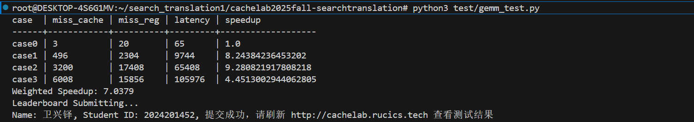
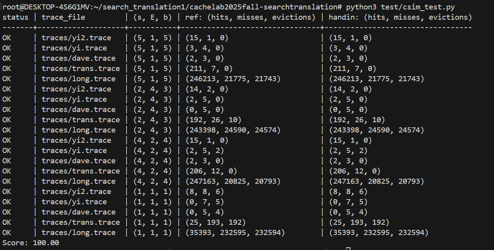

# CacheLab 报告

姓名：卫兴铎

学号：2024201452

| csim 分数 | case1 speedup | case2 speedup | case3 speedup | weighted speedup |
| --------- | ------------- | ------------- | ------------- | ----------------- |
| 100.00         | 8.24             | 9.28             | 4.45             | 7.04                 |

<!-- 保留两位小数，四舍五入 -->

Autograder 截图：

<!-- 请同时将 Github Action 中的 csim test 和 gemm test 展开截图，并保证左上角出现你的仓库名，你可能需要调整浏览器缩放 -->

<!-- 如果 Github Action 不可用，本地的两个 test 的运行截图也可以-->

## Part A: cache 模拟器

### 实现简述

<!-- 简述 LRU 替换策略的 cache 的具体实现细节 -->
1. 数据结构设计：定义了 CacheLine结构体，包含有效位、标记位和时间戳 。
                定义了 CacheSet 结构体，包含一个 CacheLine 指针，指向该组内的 E 行。
2. 解析并且检查命令行参数：使用了getopt 函数，对输入进行了一个字符一个字符的向后解析。
      （1）在 getopt 中，使用了格式字符串 "hvs:E:b:t:" 
           无冒号的不需要后续参数，带冒号的表示该字符后必须跟一个参数值。
           -s, -E, -b通过 atoi函数将命令行输入的字符串转换为整数，并赋值给全局变量 。
           -t将 optarg 指针赋值给 trace_file 变量，用于打开文件。
           -v, -h分别用于 verbose 参数或打印帮助信息。
      （2）结束循环后，检查参数。
3. 初始化cache（用s、e）并打开读取文件。
        按照预设的文件内容格式，设置以下参数处理： operation （'L', 'S', 'M'）、address（64位地址）、size（大小）、reg_placeholder（寄存器）。
        用fscanf函数进行规格化的处理。
4. 处理读取内容。
        （1）处理-v 指令。
        （2）引入全局计数器，每处理一行文件操作，便加一，代表时间流逝。
        （3）使用accessCache 函数，先使用位运算处理内存地址，得到tag和set_index。
             在set_index组内查找所有行。若有效位非0和tag相同，则命中，需记录并更新时间即可；若有效位非0，查找并记录时间最小的，准备剔除；若有效位为0，寻找第一个空行，以备插入。
             若hit，不处理；若miss,有空行，直接插入，无空行，需要驱逐最小的时间项。

### 亮点

<!-- 如果你有模拟性能上的优化，或者别的什么亮点可以用额外的篇幅具体讲讲，否则留空就可。 值得一提，这作为了第36次CSP考试的大模拟原题。 -->

## Part B: 矩阵乘法优化

<!-- 下文请统一用 "行 * 列" 来表述矩阵形状 -->

<!-- 如果你想用 x, y 或者 i, j 变量来辅助你的表述，
请保证他们的对应关系是 x,y <=> i,j <=> 行,列，不然助教会晕，你们的分数也可能跟着晕，
我指你想说某个单独的矩阵中的 x 行 y 列的时候，不要说 y 行 x 列，
当然有三个矩阵的时候就没这回事了
 -->

### 亮点

<!-- 这相当于摘要，用最精简且可以被理解的关键词 + 简短的句子，分点描述你所有使用到的优化技巧，如果他们的重要性不同，请按顺序讲 -->

<!-- 比如：1. 分块：xxxx -->
1. 分块。（行 * 列）
   分块大小 (M_r * N_r)。这里的 M_r 是在一次内层迭代中计算的行数，N_r 是列数。
   需要三类寄存器：（1）累加器用于存储 C 的中间结果。数量为 M_r * N_r
                  （2）输入数据用于暂存从内存加载的 A 和 B 的值。数量为 M_r (A 的一列) + N_r (B 的一行)
                  （3）辅助寄存器 : 用于循环计数、基地址指针、步长计算等。数量不定。
2. 边缘处理，即使用分治策略，将矩阵分为主块+剩余块进行处理。
<!-- 由于你还需要在后文详细说明，因此不必在此大费周章 -->

#### 我认为的最优秀的实现排序

<!-- 请排序这三个 case，把你认为的最优秀的实现排在前面 -->
1. case3
2. case1
3. case2

### case3
cache miss ： 6008        
register miss ：15856

1. 在 Naive 算法中，内层循环访问 B[k][j]。由于 P=29，相邻 k 的内存地址差为 29 * 4 = 116 字节。
   116字节远大于 Cache Line 大小。当 CPU 加载 B[k][j] 时，会加载包含该点的整个 Cache Line（是按行序的）。由于下一次访问是 B[k+1][j]（地址 +116），它位于另一个 Cache Line。当前 Cache Line 中只有 1 个 int 被本次计算使用了。其余均为无效数据。利用率为（1/n）
2. 矩阵分块。
主体区域：0 < i <25, 0 < j < 28。使用5 * 4 分块。
底部边缘：25 <= i <29 ，0 < j < 28。使用4 * 4 分块。
右侧边缘：0 <= i <29 ，j=28。使用 1 * 1分块。
3. （1）累加器 (c00 到 c43)：中间计算结果不需要反复写回内存，直到所有 k 计算完毕才写回C。   
   （2） 数据复用：在内层 k 循环中，加载 4 个 B 元素“reg b0...b3 ”加载了 B 的一行。这 4 个 b 值被随后计算的 5 行 A 共同使用，每个 b 值被复用了 5 次。
                   加载 5 个 A 元素“ i, i+1, i+2, i+3, i+4行 ”的元素到 reg a。在每一次计算 a 时，它被用来乘以 4 个 b ，每个 a 值被复用了 4 次。
    （3）B 的加载方式：
       reg b0 = B[b_idx + 0];
       reg b1 = B[b_idx + 1];
     B[k][j] 到 B[k][j+3] 在内存中是连续的。当加载 b0 时，它会加载整个 Cache Line，这其中必然包含 b1, b2, b3等后继。因此，后续的 3 次加载几乎是 Hit的。
4. （1）Register Miss 指的是需要从 Cache 读取数据到寄存器（Load），或者从寄存器写入(Store) 的次数。
             a.主体 (5x4 分块)：i (5行) * j (4列) * k (35深度)。i循环执行5次，j循环执行7次，共 35 个块。 
              单块 Load 次数：Load A 为5 个 (a 在 5 行中各加载一次)。Load B为4 个 (b0...b3)，共9次。
              则总 Load为35块 *  35深度 * 9  = 11,025。
              总 Store (写回 C): 35块 * 20  = 700次。
             b.底部边缘 (4x4 分块)：i (1次, 4行) * j (7次, 4列) * k (35深度)。
              单块 Load 次数为：Load A是4 次。Load B是 4 次。总共8次。
              总 Load:为 1 * 7块* * 35 k * 8  = 1,960次。
              总 Store: 7块 * 16  = 112 次。
             c.右侧边缘 (处理第 28 列)：i (0~28, 29行) * j (1次) * k (35深度)。
              单次循环 Load:Load A是 1 次 。Load B:是1 次。
              总 Load: 29 * 35 * 2 = 2,030 次。
              总 Store: 29 * 1 = 29 次。
    理论 Register Miss (Load+Store): 15,015 + 841 =15,856
    (2)Cache Miss 是由空间局部性的丧失造成的。
             a.矩阵 A 访问模式为A[(i+0)*n + k]。随着 k 增加，地址连续增加。绝大多数是 Hit。只有换行时发生一次 Miss。由于采用了 i-j-k 的循环，A 的行数据在 j 循环切换时需要被反复加载。由于 B 的占用了大量 Cache，导致 A 的数据难以驻留，引发了额外的 Miss,暂无法计算。
             b.矩阵 B 为访问模式：B[k*p + j]。在 5 * 4 中，加载了 4 个 B 。这 4 个在内存上是连续的（位于同一行），所以通常只会触发 1 次    Miss来加载这一行。但是，下一轮 k 循环，跳到了下一行。这又是一个新的 Cache，又是 1 次 Miss。在每次 k 循环中，加载 B 的 4 个数据会导致 1 次必然的 Cache Miss。Phase 3 对 B 的最后一列进行了 29 次扫描，每次包含 35 次访问，次次 Miss。
             B Misses 总数:Phase 1: 35块 * 35 = 1,225 次。
                           Phase 2: 7块 * 35  = 245 次。
                           Phase 3:29 * 35  = 1,015 次。
5. case3的优化包括选择分块的方式和处理边缘的方法。最初是主块为4*4，然后用朴素算法计算两个边缘；然后优化边缘，对边缘也进行分块，但 4*4的主块会让边缘被划分为3块；最后将主块变为5*4，然后边缘也可以用分块的方法划为2块。

### case1
cache miss ： 496        
register miss ：2304 
4. 理论上：A 矩阵 发生256 (总数)/16 =16 次 Miss。
          B 矩阵 与 A 同理。
          对于C 矩阵， CPU 需要先读取 C 的旧值，加完后再写回。第一次碰这块内存，就需要把它加载至 Cache。256/16=16 次 Miss。
          理论只需48次cache miss。但实际用了496次。
   尝试解释：
        a.矩阵维度 N=16, P=16, M=16。16 是 2 的幂次。这意味着矩阵 A、B、C 的每一行大小、总大小，在二进制地址上都有整齐的对齐规律（数据未在内存中完美分布）。Cache 采用组映射（而非全相联），映射公式是 (Address >> b) % S。由于 A、B、C 都是连续分配的，且大小正好是 2 的倍数，它们的基地址极有可能映射到同一个 Cache Set。
        b.Thrashing：在内层循环 k 中，你加载 A 的数据（占用 Cache Set X）。 B，B 的这一行也映射到了 Set X。如果 Cache 的关联度（Way）不够大，或者 LRU 策略决定替换，加载 B 就会把 A 踢出去。下次用A则会重新加载。
        c.16 个块,k 循环执行 16 次,有256次内层迭代。如果在每一次 k 循环中，A 和 B 互相冲突，单次迭代 Miss为2 次，总 Miss 为512.这表明了在绝大多数 k循环中，都发生了 A 和 B 的互相占用。差额可能是因为在某些特定的边界没有发生冲突，或者 Cache 的关联度。
1. 由于 M=16, N=16, P=16 均能被 4 整除，Case 1 只有主体区域，没有边缘。总块数为 16 个块。
2. （1）累加器 (c00 到 c33)避免在内层 k 循环中反复读写内存。
   （2）数据复用上，在内层 k 循环的每一步中，加载 4 个 B 元素 (reg b0...b3)，每个 b 值被复用了 4 次。加载 4 个 A 元素 (a0...a3)，每个 a 值被复用了 4 次。
   （3）B 的空间局部性：B[k][j] 到 B[k][j+3] 在内存中是绝对连续的。当加载 b0 时，b1, b2, b3 必然已经随之进入Cache。后续 3 次加载几乎 Hit。
3.  Register Miss 
      计算 Load 次数：单次 k 迭代，Load A:=4 次 。Load B=4 次 。一共8 次。单个块的总 Load为16 * 8 = 128$ 次。全部块总 Load为16 * 128 = 2,048 次。
      计算 Store 次数：每个块计算完成后，写回 16 个累加器 (c00...c33)。全部块总 Store：16 * 16 = 256次。
      Register Miss 总计：2,048 + 256 = 2,304

<!-- 1. 展示你的 cache miss 和 register miss -->

<!-- 2. 分析你的算法的理论 miss，如果和实际不完全相符，误差可能来自于哪里
（通常你的分析不用完全准确，不影响后续你展示算法，或者不同算法性能的大小关系即可） -->

<!-- 3. 你是怎么想到你的方法的，2 和 3 点可以调换顺序或者合并。或者说你的方法有哪些巧妙的设计。 -->

<!-- 4. 我们预计准确分析理论 miss，甚至是大致分析都可能是相当费力的，
此时我们更偏向你挑选一个你最想分享的 case 认真分析，其他 case 可以草率一点。
但这不代表我们只看一个 miss 分析，而是在你精力有限时请把最精华的写出来。
不要费了功夫写了三个分析但每个都浅尝辄止。
我们认为的排序是：
三个都精细分析 > 精细分析一个，潦草分析两个 > 只精细分析一个 > 潦草分析三个
 -->

<!-- 5. 分析 naive 算法的 cache miss 原因，视总篇幅也可以不讲 -->

<!-- 不要贴大段的代码，如果需要贴代码，请一小节一小节，并配合文字解释 -->

<!-- 你可以贴伪代码，或者用注释替代不重要的部分，尽量让报告精简 -->

<!-- 虽然我们分成了 3 节分别对应每个 case，但你不用每次都重复描述共通的思路，你可以修改报告的形式 -->

<!-- 原则上，简单的方法一个 case 所需描述的字数不应超过 500 字，复杂的不应超过 1000 字 -->

<!-- 如果你没有什么优化思路，这一节也可以就讲 baseline 算法的 cache miss 的分析 -->

<!-- 如果你的优化思路特别多，请先分点简述一下，如果超出了我们的字数限制，请把最重要的部分在规定字数内先解释清楚，再用”明显的分割线“隔开，再接着写次重要的优化 -->

<!-- 尽量给出你每个优化，或者是渐进的优化中每一步对性能的提升分别是多少 -->

<!-- 如果你有除了 gemm_test.py 脚本算出来的 cache miss 和 register miss 的其他数据展示，比如你跑了个参数的网格搜索，
请保证这些数据是可复现的，给出复现的代码，和复现代码的执行方法文档。这些应该包含在提交仓库中
-->

### case2
cache miss ： 3200        
register miss ：17408
代码逻辑同case1，不再分析。
只分析为什么不采用其他形式的分块。
在两个32×32矩阵运算时，仍然使用4*4分块。首先是因为4是32的因数，这样做可以避免边缘处理。因为在case3中，边缘处理的第二部分是次次miss的。8*8分块的累加器已经超过了36个。
如果想用2*8分块，可以将它与4*4分块在算术强度上做一个对比。两者在一次K循环中都做了32次运算，计算量是一样的。访问量上，4*4分块为8。2*8分块为10。则4×4分块的算术强度是4，2*8分块儿的算术强度是3.2。
便排除掉2*8分块儿。并且2*8分块比4*4分块多占用了两个数据寄存器，在有限的条件下尽量避免使用它。
## 反馈/收获/感悟/总结

<!-- 这一节，你可以简单描述你在这个 lab 上花费的时间/你认为的难度/你认为不合理的地方/你认为有趣的地方 -->
具体时间忘了，写出第一版代码时间较短，优化和报告时间比较长。优化到一定程度之后就太难了。
<!-- 或者是收获/感悟/总结 -->
可能是我真的会用cache的知识了吧。
<!-- 我们会认真听取大家的建议～ -->

## 参考的重要资料

<!-- 有哪些文章/论文/PPT/课本对你的实现有重要启发或者帮助，或者是你直接引用了某个方法 -->

<!-- 请附上文章标题或概述和可访问的网页路径 -->
这是知乎的网站   https://zhuanlan.zhihu.com/p/438173915
这是CSDN的网站   https://blog.csdn.net/m0_65591847/article/details/132323877?ops_request_misc=%257B%2522request%255Fid%2522%253A%252272fc65533fa0014d308a8b7c9484c991%2522%252C%2522scm%2522%253A%252220140713.130102334..%2522%257D&request_id=72fc65533fa0014d308a8b7c9484c991&biz_id=0&utm_medium=distribute.pc_search_result.none-task-blog-2~all~top_positive~default-1-132323877-null-null.142^v102^pc_search_result_base8&utm_term=cachelab%E5%AE%9E%E9%AA%8C&spm=1018.2226.3001.4187
和https://blog.csdn.net/weixin_42294984/article/details/80738945?ops_request_misc=%257B%2522request%255Fid%2522%253A%252272fc65533fa0014d308a8b7c9484c991%2522%252C%2522scm%2522%253A%252220140713.130102334..%2522%257D&request_id=72fc65533fa0014d308a8b7c9484c991&biz_id=0&utm_medium=distribute.pc_search_result.none-task-blog-2~all~sobaiduend~default-4-80738945-null-null.142^v102^pc_search_result_base8&utm_term=cachelab%E5%AE%9E%E9%AA%8C&spm=1018.2226.3001.4187
<!-- 不列出参考了的参考资料会被认为是学术不端 -->
