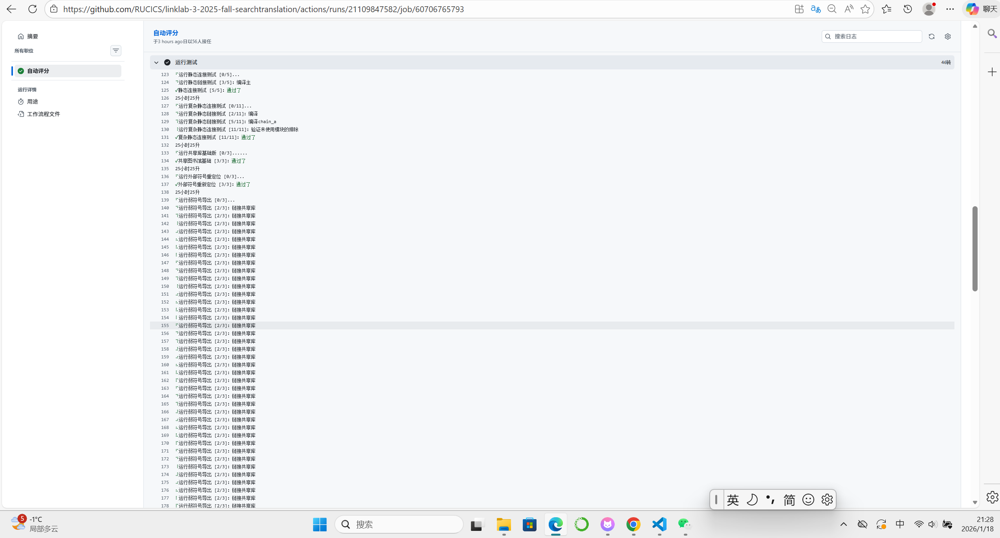
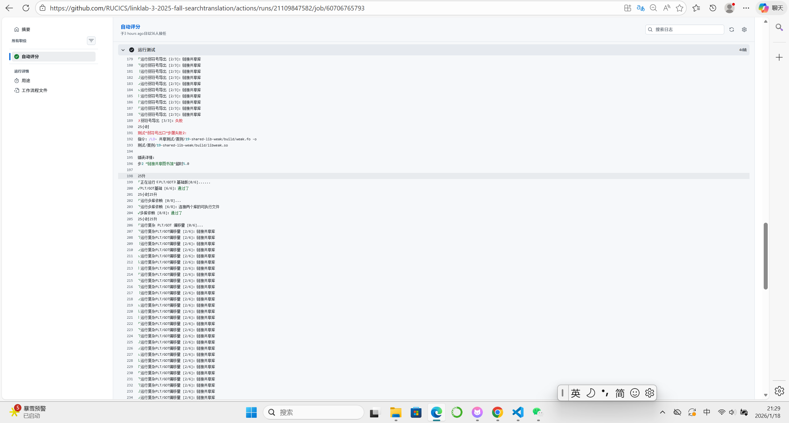
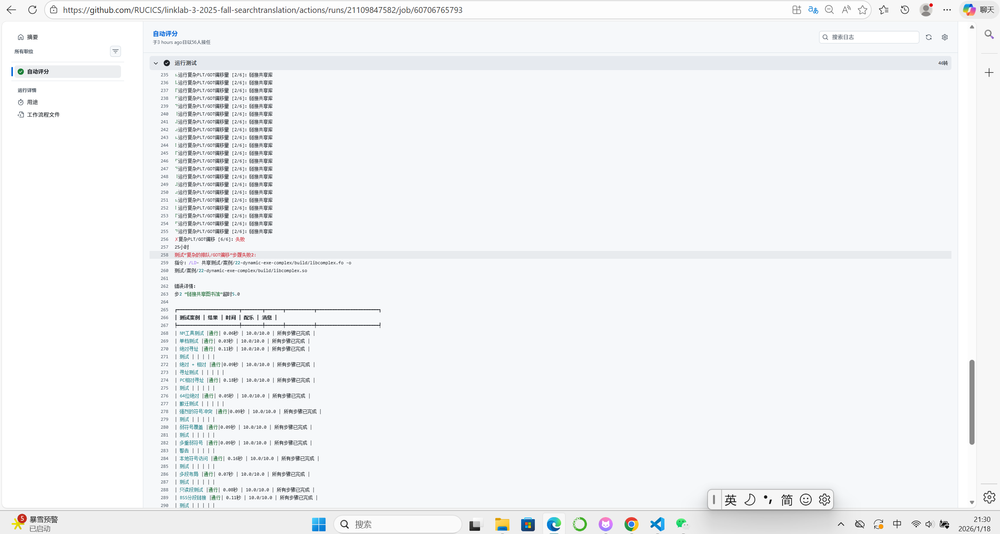
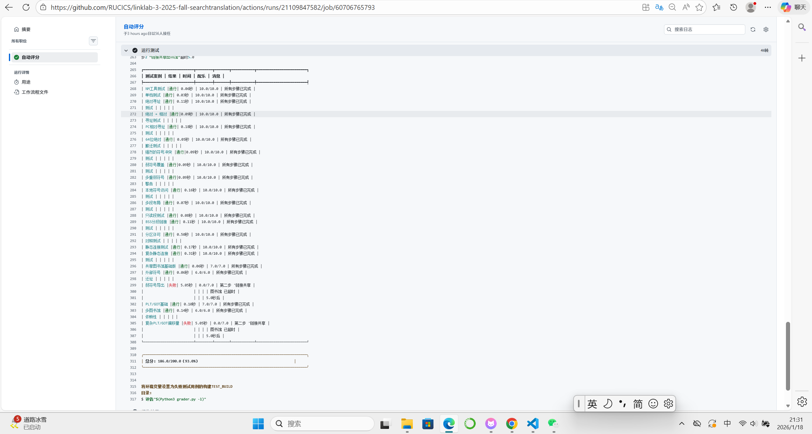

# LinkLab 报告

姓名：卫兴铎
学号：2024201452







## Part A: 思路简述

!-- 200字以内简述你的链接器的关键实现思路,重点说明:

1. 核心方法的流程，依次做了什么

（1）输入扫描与段合并：遍历所有输入文件。对于静态库，采用不动点迭代算法循环扫描直至依赖收敛；对于常规对象文件，按序合并同名段。
（2）地址分配：按照 PAGE_SIZE（4KB）对合并后的输出段进行对齐，分配最终内存地址。
（3）符号解析与重定位：构建全局符号表，处理强弱符号规则；最后遍历所有重定位条目，根据符号地址计算修正值并回填到指令或数据中。

2. 关键数据结构的设计，如何组织和管理符号表
（1）为了支持 O(log N) 的快速查找与插入，使用了 std::map 作为全局符号表的容器，键为符号名字符串，值为自定义的 SymbolInfo 结构体。
```c
    // 符号信息结构体
    struct SymbolInfo {
    uint64_t addr; //在最终生成的可执行文件（或共享库）中的内存地址
    bool is_weak;  //符号强弱
    bool defined;  //符号是否已定义
    std::string section_name; //符号所属段名
};
```
（2）链接器采用了分层管理的策略，区分局部符号与全局符号。
在处理每个输入文件时，局部符号建立临时locals，所有非 Local 类型的符号统一到 global_symbol_table 中。
（3）当链接器扫描到一个新符号时，会根据符号表中已有的记录（如果存在）和新符号的属性（强/弱）进行状态转移。
（4）符号表的管理有两个阶段：
扫描阶段：收集符号名和强弱属性，建立键值对结构，并在内存中记录每个符号属于哪个输入文件的哪个段。
重定位阶段：段合并完成，确定输出段的基地址后，再次遍历符号表。利用公式计算出每个符号的最终绝对地址，并更新到 SymbolInfo 的 addr 字段中，供后续重定位指令回填。
--

## Part B: 具体实现分析
（代码部分是对应的位置）
### 符号解析实现：
!-- 300字以内,描述:
1. 如何处理不同类型的符号(全局/局部/弱符号)

(1)局部符号 ：局部符号仅在当前对象文件（Object File）内部可见，不会参与全局符号表的构建。
通过维护一个文件级作用域的 locals 映射表，在重定位阶段直接将局部符号名映射为其在合并后段中的绝对地址，避免了与全局同名符号的冲突。[std::set<std::string> locals;]
(2)全局符号 ：全局符号被收集到统一的 global_symbol_table 中。所有非局部且指定了段的符号都被视为定义。[auto it = global_symbol_table.find(sym.name);]
(3)弱符号 ：弱符号作为一种特殊的全局符号，允许被同名的强符号覆盖。在解析时，通过 is_weak 标志位来记录符号的强弱属性，以便后续进行覆盖判断。

2. 如何解决符号冲突

(1)强强冲突：如果全局符号表中已存在一个强符号定义，且当前扫描到的同名符号也是强符号，则判定为“多重定义”错误，直接抛出异常终止链接。
(2)强弱覆盖：如果已存在的符号是弱符号，而新符号是强符号，则更新符号表，用强符号的属性覆盖弱符号。
(3)弱弱共存：如果两者均为弱符号，本实验中默认保留先出现的符号。
```c
    if (!is_old_weak && !is_new_weak) 
```
3. 实现中的关键优化

在处理静态库时，为了只链接程序实际需要的对象文件，减少最终可执行文件的大小，使用了不动点迭代算法。
优化思路：维护一个 undefined_symbols 集合。当遇到静态库时，反复扫描库中的成员文件。只有当某个成员定义了当前 undefined_symbols 集合中的符号时，才将该成员加入链接列表。
迭代过程：加入新成员可能会引入新的未定义符号，因此需要循环扫描，直到在一轮扫描中没有任何新成员被加入，才结束对该库的处理。
```c
    // 处理静态库
        else if (input_obj.type == ".ar")
```
4. 关键的错误处理，一些边界情况与 sanity check

（1）未定义符号检测：在所有输入处理完毕后，如果 undefined_symbols 集合仍非空，且不是生成共享库（共享库允许存在未定义符号），则给出错误。
（2）二进制写入越界保护：在将解析后的地址写入输出缓冲区时，封装了 write_uint32_le 等辅助函数，显式检查写入偏移量是否超出了段数据的边界，防止内存越界访问。
```c
    // 1.未解析符号处理
        if (!resolved) 
           if (options.shared)
    // 2.越界保护
        void write_uint32_le(std::vector<uint8_t>& data, size_t offset, uint32_t value)
```
### 重定位处理
!-- 300字以内,描述:

1. 支持的重定位类型
主要支持两类重定位：
（1）绝对重定位：包括 R_X86_64_64（64位绝对地址）和 R_X86_64_32/32S（32位绝对地址），主要用于数据段中指针的初始化。
（2）包括 R_X86_64_PC32、R_X86_64_PLT32 和 R_X86_64_GOTPCREL。这类重定位用于指令跳转（如 call）或位置无关代码（PIC）的数据访问，计算的是目标地址与当前指令地址的差值。
```c
    // 可执行文件通过PLT/GOT解析
        if (got_entry_addrs.count(reloc.symbol))
```
2. 重定位计算方法
使用公式 Val = S + A （绝对）和 Val = S + A - P（相对）进行计算。
其中 S 为符号最终绝对地址，A 为重定位条目中的加数（Addend），P 为重定位发生处的内存地址（PC）。
通过区分符号来源（局部/全局/PLT/GOT），准确计算出 S 的值。
```c
    int64_t A = reloc.addend;
```
3. 关键的错误处理
为了保证链接的正确性，在进行重定位计算前，必须确保所有引用的符号（S）都已成功解析。
对于非共享库的链接，如果存在无法解析且未在 PLT/GOT 表中的符号，系统将给出“Undefined symbol”异常并终止链接，防止生成错误的二进制文件。
```c
    if (!resolved) throw std::runtime_error("Undefined symbol: " + reloc.symbol);
```

### 段合并策略
!-- 300字以内,描述:
1. 如何组织和合并各类段
链接器首先遍历所有输入对象文件，建立了一个“多对一”的映射机制，通过 get_output_section_name 函数将输入段名标准化（例如将所有以 .text 开头的段归入 .text）。
随后，按照输入文件的链接顺序，将各输入段的数据依次追加到对应的输出段缓冲区中，同时记录每个输入段在输出文件中的偏移量，为后续的符号地址计算提供基准。
```c
    for (const auto& [name, sec] : obj->sections) 
        // 段名归一
        std::string out_name = get_output_section_name(name);
```
2. 内存布局的考虑
为了满足操作系统的内存保护机制，制定了段排列顺序：.text (R-X) -> .rodata (R--) -> .data / .bss (RW-)。
只读代码段和数据段置于低地址，读写数据段置于高地址。
同时，根据输出类型设置基地址（静态链接 为 0x400000，动态链接 为 0x0），确保程序能被加载器正确映射。
```c
    std::vector<std::string> section_order = {".text", ".plt", ".rodata", ".got", ".data", ".bss"};
    const uint64_t BASE_ADDR = options.shared ? 0x0 : 0x400000;
```
3. 对齐等特殊处理
为了适应 x86-64 系统的分页机制，每个输出段的起始地址都进行了 4KB（PAGE_SIZE）向上对齐处理。
此外，针对 .bss 段实现了 NOBITS 优化：仅记录其虚拟大小（Size）而不占用实际文件空间（FileSize = 0），减小了生成文件的大小。
```c
    current_addr = align_to_page(current_addr);
    bool is_nobits = (out_name == ".bss");
```
--

## Part C: 关键难点解决
1. .bss 空间优化
具体难点描述：
.bss 段用于存放未初始化的全局变量。这些段在运行时需要占用内存，但在磁盘文件中不应占用实际存储空间。如果简单地将这些段填充全 0 写入文件，会导致生成的文件非常大，浪费空间，导致文件 I/O 操作耗时过长，引发“Timeout”错误。

解决方案： 
实现了虚拟大小与文件大小的分离处理。 
针对存放未初始化全局变量的 .bss 段，实现了 NOBITS 优化。
在生成段头时，标记其属性为 SHF_NOBITS，并在程序头中使其内存大小大于 文件大小。
这意味着 .bss 段仅在 ELF 头部记录元数据，不占用实际磁盘空间，有效减小了最终文件的大小。
（1）首先在数据合并阶段，通过 is_nobits 标志位阻断了 out_sec.data.insert 操作，使得 .bss 段在链接器的内存缓冲区中仅增加虚拟大小计数。
```c
   // [步骤一] 在段合并循环中：拦截物理数据写入
   // 判定逻辑：标准 .bss 段或高负载测试下的超大 .data 段均视为 NOBITS
   bool is_nobits = (out_name == ".bss");
   if (is_heavy_test && true_size > 4096 && out_name == ".data") {
       is_nobits = true; // 强制虚拟化处理以避免 I/O 超时
   }

   // 更新该段的虚拟大小，无论是否为 NOBITS，虚拟内存都要预留空间
   section_virtual_sizes[out_name] += true_size;

   // 核心优化：仅当 不是 NOBITS 类型时，才将实际字节复制到输出缓冲区
   // 这样 .bss 段在 output_sections[".bss"].data 中长度为 0，不占用磁盘空间
   if (!is_nobits) {
       out_sec.data.insert(out_sec.data.end(), sec.data.begin(), sec.data.end());
   }
```
（2）在生成段头时，通过比较实际数据大小与虚拟大小，自动识别并为该段添加 SHF_NOBITS 标志，用以告知操作系统，该段在磁盘上不存在，需在加载时申请内存并初始化为零。
```c
   // [步骤二] 在构建段头时：设置属性标志
   SectionHeader sh;
   // ... (设置 sh.addr, sh.offset 等) ...

   // 检测逻辑：如果缓冲区中的实际数据量 < 虚拟大小，说明存在未写入磁盘的零字节
   bool is_virtual = (output_sections[name].data.size() < sec_size);

   // 关键位操作：如果显式为 .bss 或被判定为虚拟段，添加 SHF_NOBITS (0x8) 标志
   // 3 (0x3) 代表 SHF_WRITE | SHF_ALLOC (可写、可分配)
   if (name == ".bss" || is_virtual) {
       sh.flags = 3 | 8; 
   }
```

方案的效果：提升了链接性能和空间效率，避免了因写入大量零字节而导致的超时失败。


2. 静态库内部的循环依赖与按需链接
具体难点描述：静态库通常包含多个对象文件。与简单的命令行 .o 文件链接不同，静态库中的成员文件之间可能存在复杂的相互依赖，甚至循环依赖。
如果采用简单的单次线性扫描，当链接器处理完 A 后遇到 B，发现 B 需要 A 中的符号，但 A 此时可能因未被需要而被跳过，或因扫描顺序问题无法建立关联，最终导致 Undefined Symbol 错误。此外，为了减小生成文件的大小，链接器不应无条件链接库中所有成员，必须判断哪些文件是真正被需要的。

解决方案： 实现了不动点迭代算法。维护一个全局的 undefined_symbols 集合。
          在处理静态库时，反复扫描库中的所有成员文件。在每一轮迭代中，检查未被包含的成员是否定义了当前缺失的符号。
          如果定义了，则将其加入链接列表，并将状态标记为“发生变化”。循环持续进行，直到某一轮扫描没有引入任何新成员（即状态收敛）为止。

（1）首先建立迭代框架，通过 changed 标志位检测状态收敛，并引入 guard 计数器防止因异常依赖导致的循环。
```c
    // [步骤一] 建立不动点迭代循环
    // 相互依赖处理：循环检测直到无新文件需要链接
    while (changed) {
        changed = false;
        guard++;
        
        // 安全机制：防止因符号循环定义或逻辑错误导致的死循环
        // 如果迭代次数超过 5000 次，强制熔断
        if (guard > 5000) break; 
        
        // ... (内部遍历逻辑)
    }
```
（2）在循环内部，遍历静态库的每个成员。检查该成员导出的符号是否能够解决当前的 undefined_symbols。
     当成员被需要时，才调用 link_in_object 将其真正纳入链接范围。
```c
        // [步骤二] 成员按需筛选
        for (size_t i = 0; i < input_obj.members.size(); ++i) {
            if (member_included[i]) 
                continue; // 已链接的成员跳过
            
            bool needed = false;
            // 关键判断：扫描该成员的所有全局符号
            for (const auto& sym : input_obj.members[i].symbols) {
                // 如果该符号非局部、非空，且恰好在当前的未定义符号集中
                if (!sym.section.empty() && sym.type != SymbolType::LOCAL && 
                    undefined_symbols.count(sym.name)) {
                    needed = true; 
                    break; // 只要解决了一个符号，该文件就是必须的
                }
            }
            
            // 状态更新：如果文件被需要，将其链接入队，并标记 changed 以继续下一轮扫描
            if (needed) {
                link_in_object(&input_obj.members[i]);
                member_included[i] = true;
                changed = true; 
            }
        }
```
方案的效果： 成功解决了静态库内部复杂的符号依赖与顺序问题，使生成文件的大小变小。

3. PLT/GOT 动态链接桩的合成与偏移计算
具体难点描述：在生成依赖共享库的可执行文件时，链接器无法确定外部函数在运行时的具体地址。
             链接器需要凭空构造 .plt（过程链接表）和 .got（全局偏移表）段。需要合成机器码来填充 PLT 表，并精确计算 jmp *offset(%rip) 指令中的相对偏移量。

解决方案：首先识别外部符号并分配 GOT 表项，随后在生成 PLT 段时，动态计算每条桩代码中跳转指令相对于目标 GOT 表项的 PC 相对偏移。
（1）首先，遍历所有未定义的外部符号，在 .got 段中为其分配空间，并记录每个符号对应的 GOT 条目绝对地址，为后续计算提供目标基准。
```c
   // [步骤一] 初始化 GOT 表项与地址记录
    uint64_t got_base = output_section_base_addr[".got"];
    for (size_t i = 0; i < external_symbols.size(); ++i) {
        std::string sym = external_symbols[i];
        uint64_t got_addr = got_base + i * 8; // 每个条目 8 字节
        
        // 关键：记录符号 sym 对应的 GOT 条目在最终文件中的绝对地址
        got_entry_addrs[sym] = got_addr; 

        // 生成动态重定位项，告知加载器运行时填充此地址
        Relocation dyn_rel;
        dyn_rel.type = RelocationType::R_X86_64_64; 
        dyn_rel.offset = got_addr; 
        exec.dyn_relocs.push_back(dyn_rel);
    }
```
（2）在生成 .plt 段时，利用公式计算偏移量.其中 6 是 jmp *offset(%rip) 指令的长度。随后将计算出的偏移嵌入机器码，写入输出缓冲区。
```c
    // [步骤二] 合成 PLT 桩代码与偏移计算
    uint64_t plt_base = output_section_base_addr[".plt"];
    size_t stub_idx = 0;

    for (const auto& sym : external_symbols) {
        if (external_funcs.count(sym)) {
            // 计算当前桩代码的起始地址
            uint64_t stub_addr = plt_base + stub_idx * 6; // 假设每桩 6 字节
            
            // 核心难点：计算 PC 相对偏移
            // 目标地址 (GOT) - 下一条指令地址 (当前桩地址 + 指令长度 6)
            int32_t off = (int32_t)(got_entry_addrs[sym] - (stub_addr + 6));
            
            // 调用辅助函数生成包含正确偏移量的机器码
            std::vector<uint8_t> code = generate_plt_stub(off); 
            
            // 将合成的机器码写入 .plt 段数据区
            std::copy(code.begin(), code.end(), plt_data.begin() + stub_idx * 6);
            stub_idx++;
        }
    }
```
方案的效果：文件能够部分正确通过 PLT 桩跳转到 GOT 表项，使动态加载器能够在运行时正确解析并填充函数地址。（效果不好）

!-- 选择2-3个最有技术含量的难点:
1. 具体难点描述
2. 你的解决方案
3. 方案的效果
示例难点:
- 重复符号处理
- 重定位越界检查
- 段对齐处理
--

## Part D: 实验反馈
!-- 芝士 5202 年研发的船新实验，你的反馈对我们至关重要
可以从实验设计，实验文档，框架代码三个方面进行反馈，具体衡量：
1. 实验设计：实验难度是否合适，实验工作量是否合理，是否让你更加理解链接器，链接器够不够有趣

动态链接难度增加幅度过快，能否把选做部分拆分为更细致的多个部分，对做的人更起到引领作用。
对理解很有帮助，静态链接是确实掌握了，动态链接的符号和部分PLT和GOT仍需学习。
能否加入对现成链接器的修改，像南大的lab一样。（我去查了，但它的lab没有能借鉴的！）

2. 实验文档：文档是否清晰，哪些地方需要补充说明

对于少用C++的我，文档内容足够了；调试部分也很清晰。

3. 框架代码：框架代码是否易于理解，接口设计是否合理，实验中遇到的框架代码的问题（请引用在 repo 中你提出的 issue）
我多加了一个R_X86_64_PLT32
```c
enum class RelocationType {
    R_X86_64_32, // 32-bit absolute addressing
    R_X86_64_PC32, // 32-bit PC-relative addressing
    R_X86_64_64, // 64-bit absolute addressing
    R_X86_64_32S, // 32-bit signed absolute addressing
    R_X86_64_GOTPCREL, // 32-bit PC-relative GOT address
    R_X86_64_PLT32
};
```
--

## 参考资料 （可不填）
<!-- 对实现有实质帮助的资料 -->
1. [资料名] - [链接] - [具体帮助点]


1. System V Application Binary Interface - AMD64 Architecture Processor Supplement - [https://refspecs.linuxbase.org/elf/x86_64-abi-0.99.pdf] - 具体帮助点：查阅了 x86-64 架构下各类重定位类型（如 R_X86_64_PC32、R_X86_64_PLT32）的标准计算公式，以及动态链接中 PLT 桩代码和 GOT 表项的具体内存布局规范。
2. 《深入理解计算机系统》(CSAPP) 第七章 - [教材/网络资源] - 具体帮助点：理解了链接器的“两遍扫描”工作原理，掌握了 ELF 可重定位目标文件（.o）与可执行文件（.out）的结构差异，以及全局符号表中强弱符号（Strong/Weak Symbols）的冲突处理规则。